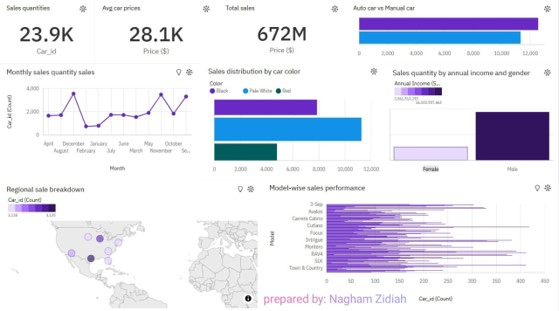

# IBM Cognos Sales Dashboard

## Overview

This project demonstrates the development of an interactive Business Intelligence dashboard using IBM Cognos Analytics.

The dashboard was designed to analyze sales performance and transform raw business data into meaningful insights through visualizations, key performance indicators (KPIs), and interactive reports.

The objective of this project was to support data-driven decision making by identifying sales trends, product performance, customer behavior, and regional sales distribution.

---

## Project Presentation

The complete project presentation is available in the `presentation` folder.

---

## Repository Structure

```text
IBM-Cognos-Sales-Dashboard
│
├── dataset
│   └── Car_Sales_Data.csv
│
├── presentation
│   ├──IBM_Cognos_Dashboard_Presentation.pptx
│
├── images
│   └── dashboard.jpg
│
└── README.md
```

---

## Dashboard Preview



---

## Dataset

The dataset contains sales-related information used to build and analyze the dashboard.

The data includes:

- Car Models
- Sales Quantity
- Sales Revenue
- Customer Gender
- Annual Income
- Car Color
- Transmission Type (Auto / Manual)
- Regional Sales Information

---

## Dashboard Features

The dashboard provides:

- Total Sales Overview
- Average Car Price Analysis
- Monthly Sales Trends
- Sales Distribution by Car Color
- Sales by Annual Income and Gender
- Regional Sales Breakdown
- Model-wise Sales Performance
- Auto vs Manual Car Sales Comparison

---

## Key Performance Indicators (KPIs)

The dashboard summarizes:

- Total Sales Quantity
- Average Car Price
- Total Revenue
- Product Performance Metrics

---

## Key Insights

Using the dashboard, users can:

- Monitor overall sales performance
- Identify best-selling car models
- Compare sales across regions
- Analyze customer purchasing patterns
- Evaluate product preferences
- Support business decision-making through data visualization

---

## Technologies Used

- IBM Cognos Analytics
- Business Intelligence
- Data Visualization
- Dashboard Design
- Data Analysis

---

## Author

**Nagham Zidiah**

Senior Data Science & Artificial Intelligence Student

LinkedIn: https://www.linkedin.com/in/nagham-zidiah-6585b3259/
